1. Go to the Azure Portal: https://portal.azure.com

2. In the Azure portal, search for and select **Microsoft Entra ID**.

   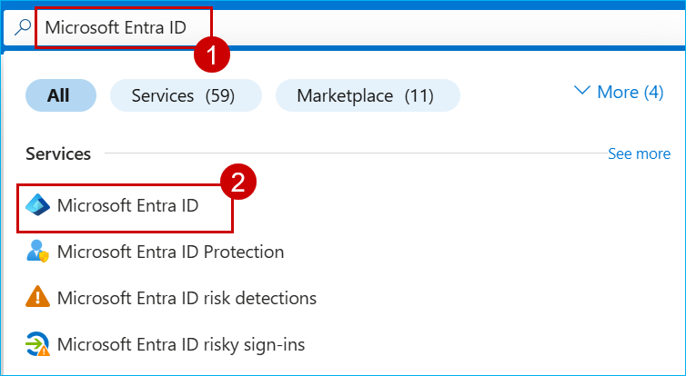

3. In the left navigation pane, under **Manage**, select **App registrations**.

   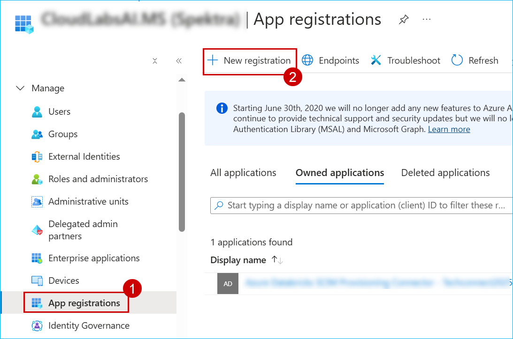

4. Enter the required details and click **Register**.

  - Name : **sp-fabcon**

  - Supported account types : **Accounts in this organizational directory only**

    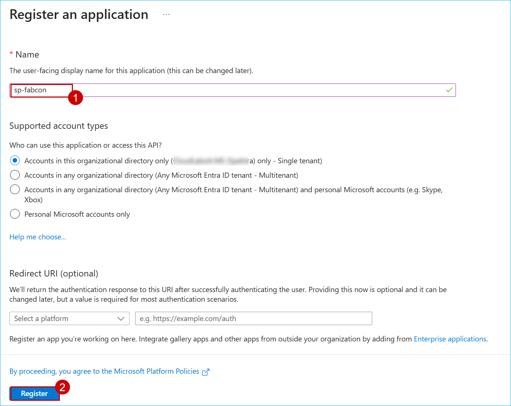

5. After creating the app registration, expand the **Manage** section in the left navigation pane, select **App registrations**, and then click **+ Add a Permission**.

   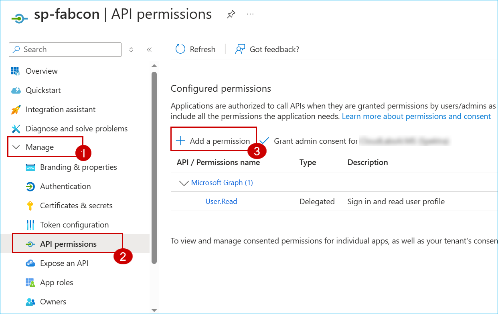

6. Scroll down on the **Request API Permissions** page and select **Power BI Service** and select Delegated Permission.

    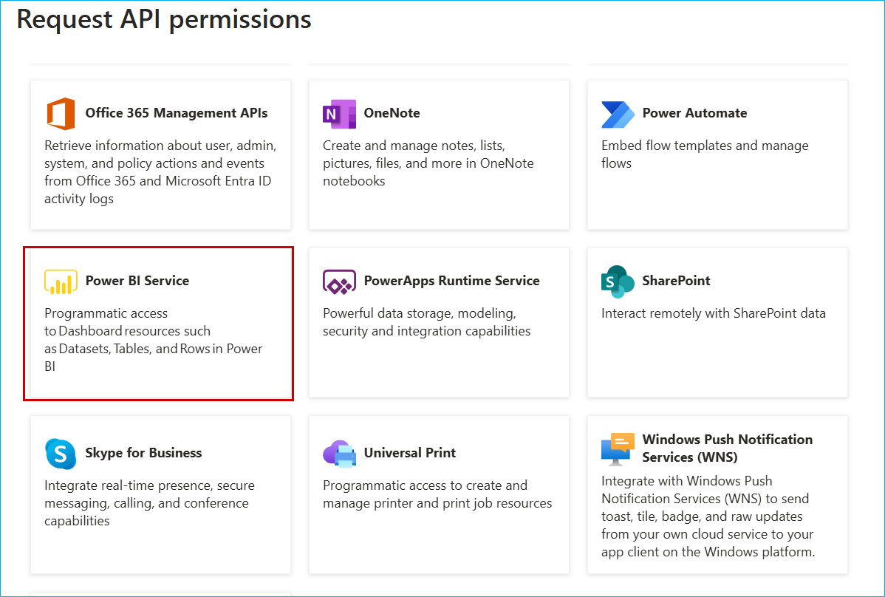

7. Grant the **Read.All** permission for all applicable APIs and click **Add permission**.

    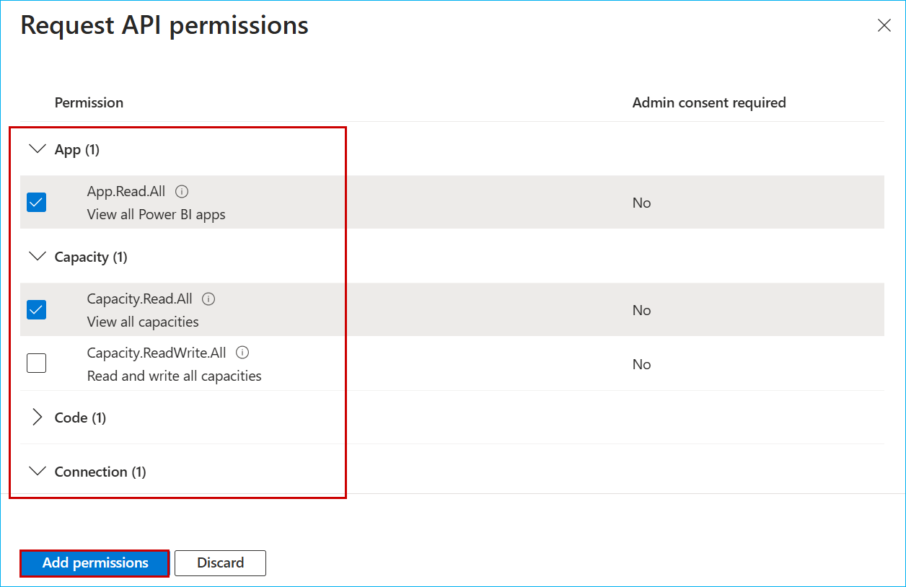

    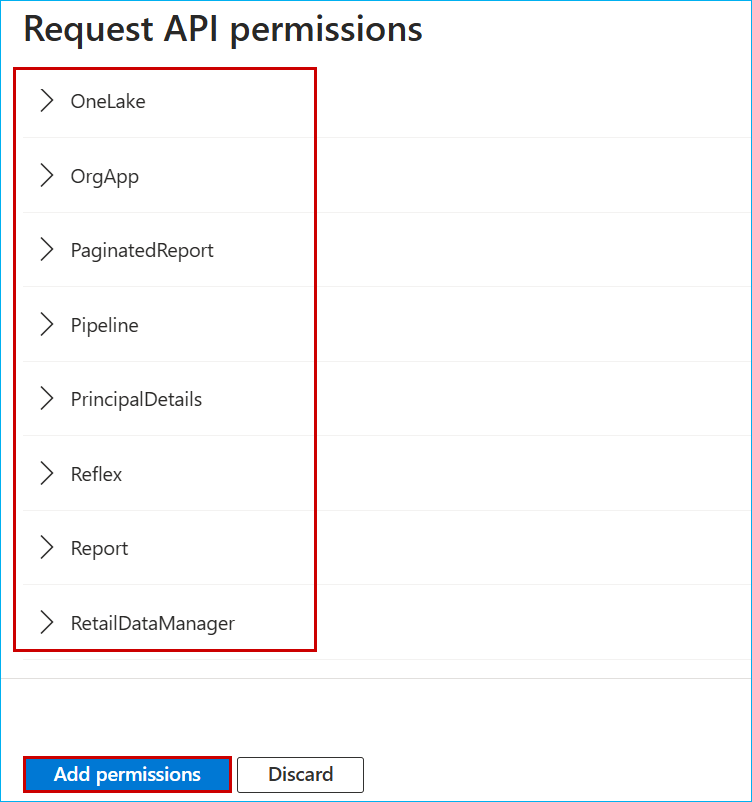

8. Under **Configured permissions**, click **Grant admin consent for [Tenant Name]** to provide consent for the API permissions.

    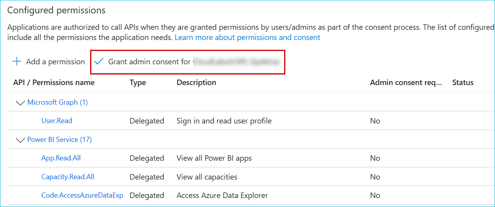

9. From the left navigation panel, go to the **Manage** section, select **Certificates & secrets**, and click on **+ New client secret**.

    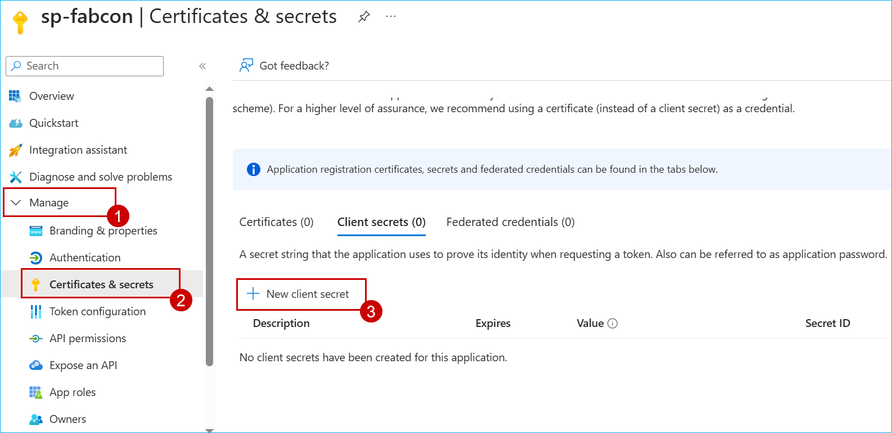

10. On the **Add a client secret** page, enter the required description and select an expiration period. and click on **Add**.

    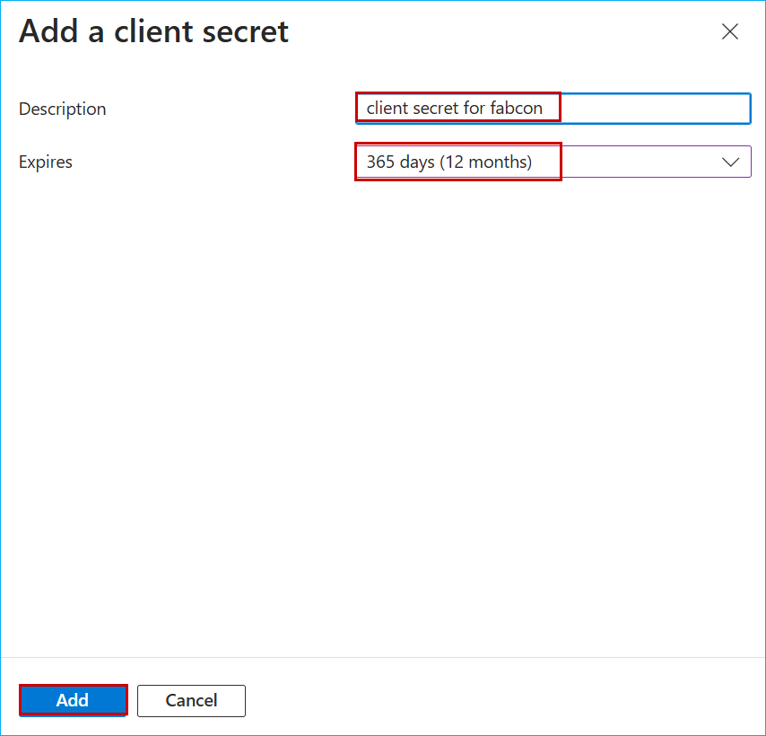

11. Go to **[app.powerbi.com](https://app.powerbi.com)** and select the **FabCon** workspace.

    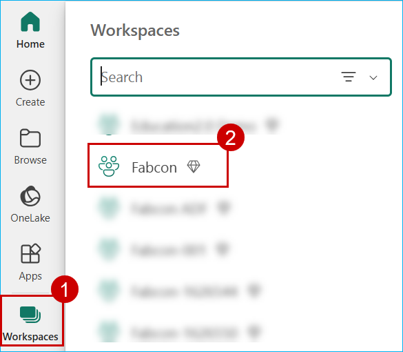

12. Click on **Manage access** in the top right corner, then select **+ Add People or Groups**.

    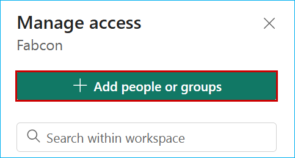

13. Search for and select the **sp-fabcon** app registration you created, grant **admin access**, and click **Add**.

    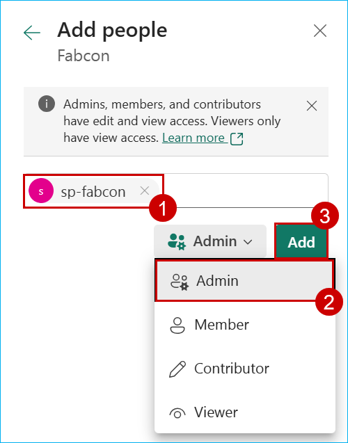